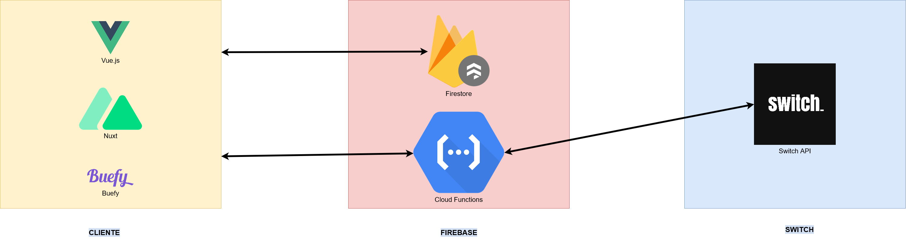

# Yummy

## Nome do projeto
Yummy - Sabe melhor!

## Descrição do projeto
Este projeto foca-se em criar uma plataforma web com o objetivo de dar exposição a vendedores locais, nos quais estes são pessoas que têm por hábito cozinhar produtos caseiros. Deste modo, cria-se um ambiente onde o cliente tem acesso a uma variada gama de produtos alimentares locais/caseiros, com um design user-friendly que torna simples e rápido a aquisição dos mesmos. Para facilitar o contacto com um vendedor que esteja próximo do local do cliente, está explícito a localização do vendedor.
Idealmente, do lado do cliente, este projeto destina-se a pessoas que procurem acima de tudo uma interação com o comércio local, desfrutando dos mais variados 
produtos que se podem consumir e do contacto pessoal com os vendedores. Do lado do vendedor, esta plataforma destina-se pessoas que tenham por hábito a confeção de produtos caseiros que necessitem de chegar ao seu público de uma forma fácil e objetiva.Ainda assim, ao criar-se um website com esta esta temática, o cliente conhece previamente aquilo que irá encontrar beneficiando o vendedor dado que este não precisa de se autopromover noutras plataformas cujo foco não se limita apenas à venda de produtos caseiros.
Assim sendo, este site torna possível gerar uma fonte de rendimento alternativa a estas pessoas, que numa situação de pandemia, por exemplo, onde possam ter perdidos os seus empregos, consigam manter-se ativas. Desta forma, é criada uma oportunidade que traz não só benefícios financeiros, mas também um sentimento de comunidade que pode ser útil especialmente para mitigar os efeitos negativos causados pelo confinamento nomeadamente o sentimento de isolação. Com isto, procuramos ter um efeito positivo nas comunidades locais facilitando o acesso à tecnologia para proporcionar o que ela de melhor tem para oferecer.

## Demo de utilização

## Screenshots

## Deployment da aplicação
[Yummy](https://yummy.cesarnogueira.com)

## Arquitetura do projeto

A aplicação foi construída utilizando [Vue.js](https://vuejs.org), [Nuxt](https://nuxtjs.org) e [Buefy](https://buefy.org) para a interface. Os dados são guardados em e recolhidos de uma base de dados [Firestore](https://firebase.google.com/products/firestore). [Cloud Functions](https://firebase.google.com/products/functions) é utilizado para receber os pedidos de pagamento por parte do cliente, fazer uma chamada à [Switch API](https://switchpayments.com/docs/dynamic-forms) e responder de volta ao cliente.



Funcionalidades mais interessantes:
 - Organização dos produtos por categoria
 - Atualização das informações em tempo real

## Como configurar o projeto localmente

Antes de começar, é necessário criar um projeto no [Firebase](https://firebase.google.com/) e associar as credenciais no ficheiro ```plugins/firebase.js```

### Que dependências são precisas?

* [NodeJS LTS](https://nodejs.org/en/)

### Quais os passos necessários para correr o projeto?

```bash
# instalar dependencias
$ yarn install

# começar servidor com hot reload em localhost:3000
$ yarn dev

# construir para produção
$ yarn generate

# deploy para o firebase
$ cd firebase
$ firebase deploy
```
